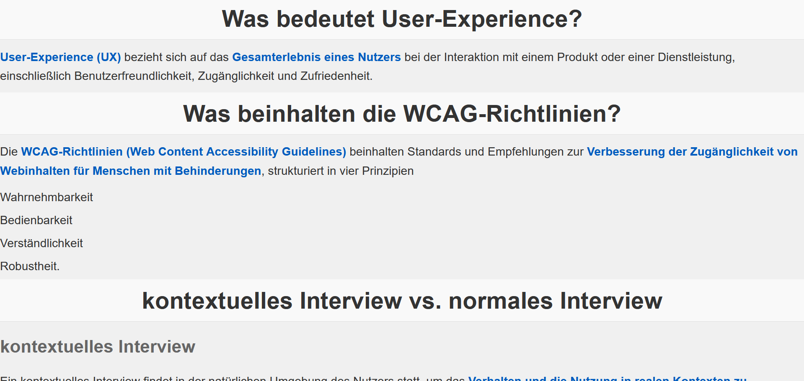

# Learning Website - Module 322 (ZP Lernziele)

## 🔗 Live Demo  
[View the Website](https://rawcdn.githack.com/KLubina/learning-website-1.ZP-lernziele-modul-322/f62bd6d774c362d796f33d3317ebc2d9efe8f2d4/index.html)  

## 📖 About  
This is a learning website I created for the first smaller exam in **Module 322** during my apprenticeship as a Software Engineer. The website helps to review and understand the key learning objectives of the module.

## 🚀 Features  
- Covers important **learning objectives** of Module 322  
- Simple and **easy-to-navigate** interface  
- Fully **responsive** design  